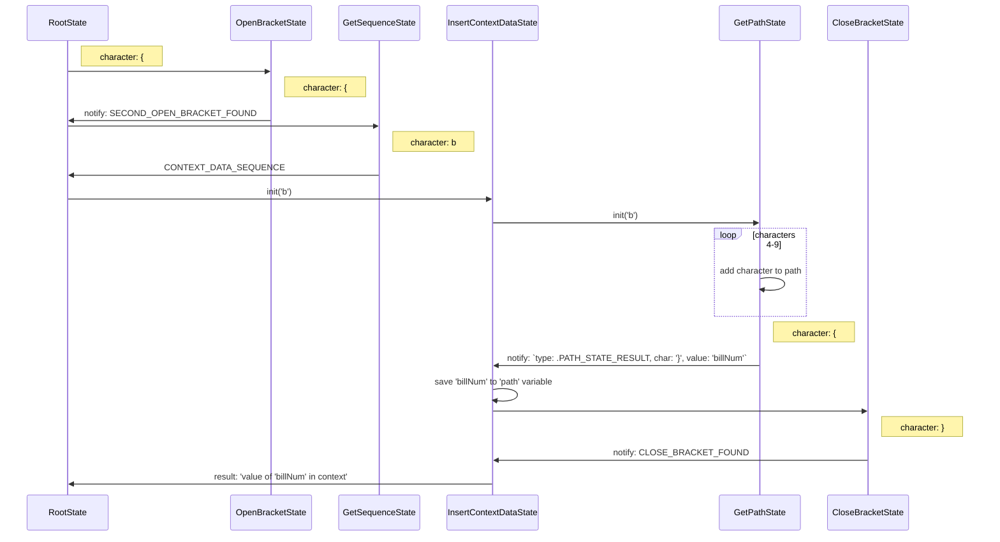

## StateMachine processing algorithm

### StubbleNotify structure

StubbleNotify {
    int type; // - notify type
    int char; // - processed symbol code
    dynamic value; // - некоторое передаваемое значение
}

### Insert data by path

```
  { { b i l l N u m }  }
0 1 2 3 4 5 6 7 8 9 10 11
```

0. RootState (initial state)
1. (`{`) `RootState` -> `OpenBracketState`: since the opening bracket is met, go to the standby state of the second bracket; -> `OpenBracketState`
2. (`{`) `OpenBracketState` -> `RootState.notify()` : since the character is a bracket, we return the flag that the second opening bracket is found with the requirement to notify the previous state; -> `GetSequenceState`
3. ({`b`) `GetSequenceState` -> `RootState.notify()` : the `b` character indicates that structure is a `path`; notify the previous state by passing the corresponding flag in notify and the first character `b`; -> `InsertContextDataState.init()` with character `b` -> `GetPathState  ` 
4-9. Adding symbols to GetPathState.path variable
10. (`}`) `GetPathState` -> `InsertContextDataState.notify()`: since the symbol `}` is not one of the allowed in the path, the parent state is notified with a structure of the following form:

```
    type: notify.PATH_STATE_RESULT,
    char: '}',
    value: 'billNum'
```

This will cause a transition to the CloseBracketState state - waiting for the second closing bracket

11. (`}`) CloseBracketState -> InsertContextDataState.notify: pass the flag that the second bracket is. After that InsertContextDataState using the saved name billNum tries to find in the context a value with that `path`, and if it is (not null) then returns its string representation as a result and goes back to `RootState`. Otherwise, it will return `null` as the result.


