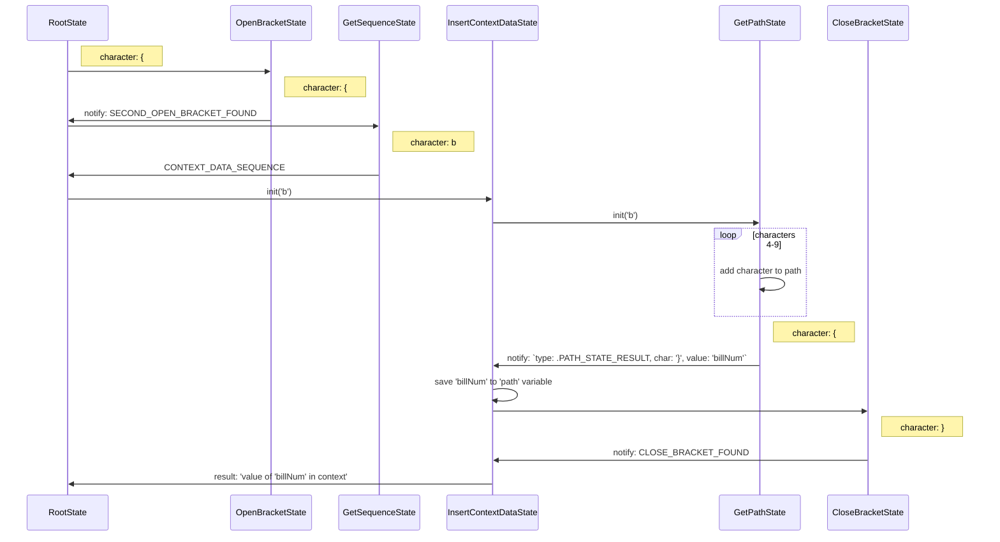

## Описание работы StateMachine на примере различных шаблонов

### Структура notify

StubbleNotify {
    int type; // - тип notify
    int char; // - символ, обрабатываемый в данный момент
    dynamic value; // - некоторое передаваемое значение
}

### Вставка значения

```
  { { b i l l N u m }  }
0 1 2 3 4 5 6 7 8 9 10 11
```

0. RootState (начальное состояние)
1. (`{`) RootState -> OpenBracketState: так как встречена открывающая скобка, переходим в состояние ожидания второй скобки;
2. (`{`) OpenBracketState -> RootState.notify : так как символ скобка, возвращаем флаг того, что вторая открывающая скобка найдена с требованием уведомить предыдущий state; -> GetSequenceState
3. ({`b`) GetSequenceState -> RootState.notify : символ `b` указывает на то, что происходит вставка данных из контектса; уведомляем предыдущий state передачей соответствующего флага в notify и первого символа `b`; -> InsertContextDataState.init с передачей первого символа `b` -> GetPathState   
4-9. Символы сохраняются в GetPathState.path
10. (`}`) GetPathState -> InsertContextDataState.notify: так как символ `{` не входит в число допустимых в пути, то происходит нотификация родительского state структурой следующего вида:

```
    type: notify.PATH_STATE_RESULT,
    char: '}',
    value: 'billNum'
```

Это вызовет переход к состоянию CloseBracketState - ожидание второй закрывающей скобки

11. (`}`) CloseBracketState -> InsertContextDataState.notify: передаем флаг того, что вторая скобка есть. после этого InsertContextDataState используя сохраненное имя billNum пытается найти в контексте значение с таким именем, и если оно есть (не null) то возвращает его строковое представление как результат и переходит обратно в RootState. Иначе вернет null в качестве результата. 



### Вставка простого Helper

Вставка результата работа helper-функции `helperName` без параметров

```
 { { $ h e l p e r N a  m  e  }  }
 0 1 2 3 4 5 6 7 8 9 10 11 12 13 14
```

### Вставка простого Helper с атрибутами

Вставка результата работа helper-функции `helperName`  передачей трех параметров:
    - значения из контекста по пути `pathToData`
    - строки "Y"
    - числа 75

```
  { { $ h e l p e r N  a  m  e     p  a  t  h  T  o  D  a  t  a     "  Y  "     7  5  }  }  
0 1 2 3 4 5 6 7 8 9 10 11 12 13 14 15 16 17 18 19 20 21 22 23 24 25 26 27 28 29 30 31 31 32 33
```

### Вставка блочного Helper

Вставка результата обработки блочной Helper-функции

```
  { { # h e l p e r N  a  m  e  }  }  <  b  o  d  y  >  {  {  /  h  e  l  p  e  r  N  a  m  e  }  }  
0 1 2 3 4 5 6 7 8 9 10 11 12 13 14 15 16 17 18 19 20 21 22 23 24 25 26 27 28 29 30 31 32 33 34 35 36 37
```

### Вставка with блока

Вставка результата обработки блока with

```
  { { # w i t h   p a  t  h  T  o  C  o  n  t  e  x  t  }  }  <  b  o  d  y  >  {  {  /  w  i  t  h  }  }  
0 1 2 3 4 5 6 7 8 9 10 11 12 13 14 15 16 17 18 19 20 21 22 23 24 25 26 27 28 29 30 31 32 33 34 35 36 37 38 39
```

### Вставка if блока

Вставка результата обработки блока if

```
 { { # i f   p a t h T  o  D  a  t  a  =  =  1  }  }  <  b  o  d  y  >  {  {  /  i  f  }  }  
 0 1 2 3 4 5 6 7 8 9 10 11 12 13 14 15 16 17 18 19 20 21 22 23 24 25 26 27 28 29 30 31 32 33 34
```

### Вставка each блока

Вставка результата обработки блока each

```
 { { # e a c h   p a t  h  T  o  C  o  n  t  e  x  t  }  }  <  b  o  d  y  >  {  {  /  e  a  c  h  }  }  
 0 1 2 3 4 5 6 7 8 9 10 11 12 13 14 15 16 17 18 19 20 21 22 23 24 25 26 27 28 29 30 31 32 33 34 35 36 37 38
```

## Заметки

- Ввести подсчет строк для вывода корректных ошибок. 
- Возможно стоит изначально разбить всю строку с шаблоном на строки по символу `\n` (перенос строки), и затем циклом в root идти отдельно по каждой строке.